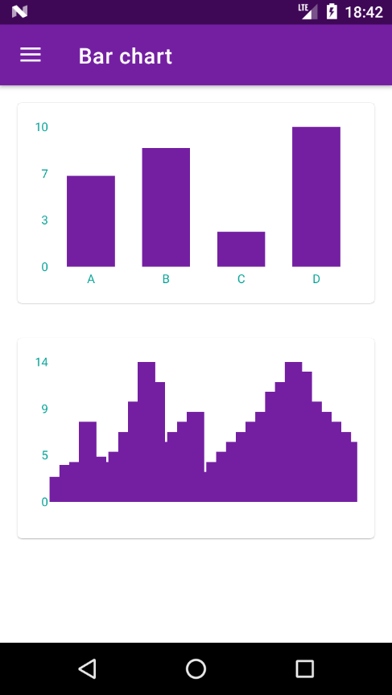

<h1 align="center">
  <a href="https://github.com/aiqfome/aiqChart">
    
  </a>
</h1>

<h2 align="center">
  AiqChart
</h2>

<p align="">AiqChart is an Android library to help with the implementation of graphics in Android applications maintained by the devs of the <a href="https://aiqfome.com/">most greedy-gut app on the internet</a>!</p>
<p>For those who would like to contribute, our idea is not just to implement the conventional features of the chart, but something that could be pleasant and intuitive when representing and visualizing data, to learn more <a href="#-contributing">visit</a>.</p>

<p align="center">
  <a href="https://github.com/aiqfome" style="text-decoration:none" target="_blank">
    
  </a>

  <a href="https://jitpack.io/#aiqfome/aiqChart" style="text-decoration:none" target="_blank">
    
  </a>

  

  

  
</p>

<p align="center">
  
</p>

---

## Table of Contents

<ul>
  <li><a href="#-getting-started">Getting Started</a></li>
  <li><a href="#-features">Features</a></li>
  <li><a href="#-contributing">Contributing</a></li>
  <li><a href="#-license">License</a></li>
  <li><a href="#-our-thanks">Our thanks</a></li>
</ul>

---

## 🚀 Getting Started

### Prerequisites

- Library - Android Jelly Bean 4.1+ (API 16)
- Sample - Android Jelly Bean 4.1+ (API 16)

### Gradle

#### [JitPack](https://jitpack.io/):

* Add it in your root `build.gradle` at the end of repositories:
```gradle
allprojects {
    repositories {
        ...
        maven { url 'https://jitpack.io' }
    }
}
```

* Add dependency in your app level `build.gradle`
```gradle
dependencies {
  implementation 'com.github.aiqfome:aiqChart:${VERSION}'
}
```

---

## 📋 Features

### Charts available
* ``LineChartView``
* ``BarChartView``
* ``HorizontalBarChartView``
* ``StackBarChartView``
* ``HorizontalStackBarChartView``


### Documentation
- To learn more about the library visit [JavaDoc](https://aiqfome.github.io/aiqChart/javadoc)

---

## 🤔 Contributing

> To get started...

### Step 1

- 🍴 Fork this repo!

### Step 2

- 👯 Clone this repo to your local machine using `https://github.com/aiqfome/aiqChart.git`

### Step 3

- 🎋 Create your feature branch using `git checkout -b my-feature`

### Step 4

- ✅ Commit your changes using `git commit -m 'feat: My new feature'`;

### Step 5

- 📌 Push to the branch using `git push origin my-feature`;

### Step 6

- 🔃 Create a new pull request

After your Pull Request is merged, can you delete your feature branch.

---

## 📝 License

<a href="LICENSE" style="text-decoration: none">
  
</a>

This project is licensed under the Apache License 2.0 - see the [LICENSE](LICENSE) file for details.

---

## 😁 Our thanks

**[Diogo Bernardino](https://github.com/diogobernardino)** ⇝ Author of the [williamchart](https://github.com/diogobernardino/williamchart) library, base library for this project

---

Made with :pizza: & :hearts:! Enjoy it!
